# 🔐 **Arogya Sahayak - NEW AUTHENTICATION APIs**

---

# **Arogya Sahayak - AUTHENTICATION API (Simplified Flow)**

*Phone → OTP → Verify → (Login OR Register)*

---

## **Base URLs**

| Environment | URL |
|-------------|-----|
| **Development** | `http://localhost:8080/api/v1` |
| **Production** | `https://api.arogyasahayak.com/api/v1` |

---

## **AUTH FLOW (New Simplified)**

```
1. User enters phone → POST /auth/send-otp
2. OTP sent → User enters OTP → POST /auth/verify-otp
3. If user exists → Return JWT + user
   If NOT → Return { "registered": false } → Redirect to Register Page
4. Register Page → POST /auth/register → Create user + JWT
```

---

## **1. POST /auth/send-otp**

*Send OTP to phone (used for both login & signup)*

```yaml
Request:
  Headers: { "Content-Type": "application/json" }
  Body:
    { "phone": "+919876543210" }

Response (200):
  {
    "message": "OTP sent to +919876543210",
    "retry_after": 60
  }

Response (400):
  { "error": "Invalid phone number format" }

Response (429):
  { "error": "Too many requests", "retry_after": 60 }
```

---

## **2. POST /auth/verify-otp**

*Verify OTP — decide login vs register*

```yaml
Request:
  Body:
    {
      "phone": "+919876543210",
      "otp": "123456"
    }

Response (200) - User Exists (Login):
  {
    "registered": true,
    "token": "eyJhbGciOiJIUzI1NiIs...",
    "refresh_token": "...",
    "user": {
      "id": "user_123",
      "phone": "+919876543210",
      "first_name": "रमेश",
      "last_name": "कुमार",
      "language": "hi"
    }
  }

Response (200) - User NOT Exists (Redirect to Register):
  {
    "registered": false,
    "message": "Complete registration"
  }

Response (400):
  { "error": "Invalid or expired OTP" }

Response (429):
  { "error": "Too many failed attempts", "retry_after": 300 }
```

---

## **3. POST /auth/register**

*Complete registration after OTP verification*

```yaml
Request:
  Body:
    {
      "phone": "+919876543210",
      "first_name": "रमेश",
      "last_name": "कुमार",
      "language": "hi"
    }

Response: Only allowed if OTP was verified recently (same phone)

Response (200):
  {
    "token": "eyJhbGciOiJIUzI1NiIs...",
    "refresh_token": "...",
    "user": {
      "id": "user_123",
      "phone": "+919876543210",
      "first_name": "रमेश",
      "last_name": "कुमार",
      "language": "hi"
    }
  }

Response (400):
  { "error": "Phone not verified with OTP" }

Response (409):
  { "error": "User already registered" }
```

---

## **4. POST /auth/refresh**

*Refresh JWT using refresh token*

```yaml
Request:
  Headers: { "Authorization": "Bearer REFRESH_TOKEN" }

Response (200):
  {
    "token": "eyJhbGciOiJIUzI1NiIs...",
    "refresh_token": "...",
    "expires_in": 86400
  }
```

---

## **5. GET /auth/profile**

*Get current user (JWT required)*

```yaml
Headers: { "Authorization": "Bearer JWT" }

Response (200):
  {
    "id": "user_123",
    "phone": "+919876543210",
    "first_name": "रमेश",
    "last_name": "कुमार",
    "language": "hi"
  }
```

---

## **6. PUT /auth/profile**

*Update profile (JWT required)*

```yaml
Body:
  {
    "first_name": "राम",
    "language": "ta"
  }

Response (200):
  { "message": "Profile updated" }
```

---

## **SECURITY & VALIDATION**

| Rule | Value |
|------|-------|
| **Phone Format** | `+91` followed by 10 digits |
| **OTP** | 6 digits, valid 5 mins, max 3 attempts |
| **Rate Limits** | 3 OTPs/hour, 60s cooldown |
| **JWT** | Access: 24h, Refresh: 7 days |

---

## **DATABASE SCHEMA**

```sql
CREATE TABLE users (
    id VARCHAR(50) PRIMARY KEY,
    phone VARCHAR(15) UNIQUE NOT NULL,
    first_name VARCHAR(50) NOT NULL,
    last_name VARCHAR(50) NOT NULL,
    language VARCHAR(10) DEFAULT 'hi',
    created_at TIMESTAMP DEFAULT CURRENT_TIMESTAMP
);

CREATE TABLE otps (
    id SERIAL PRIMARY KEY,
    phone VARCHAR(15) UNIQUE NOT NULL,
    otp VARCHAR(6) NOT NULL,
    attempts INTEGER DEFAULT 0,
    expires_at TIMESTAMP NOT NULL,
    verified BOOLEAN DEFAULT FALSE,
    created_at TIMESTAMP DEFAULT CURRENT_TIMESTAMP
);
```

---

## **FRONTEND FLOW**

```mermaid
graph TD
    A[Enter Phone] --> B{Send OTP}
    B --> C[Enter OTP]
    C --> D{Verify OTP}
    D -->|Exists| E[Login Success]
    D -->|Not Exists| F[Go to Register Page]
    F --> G[Enter Name + Lang]
    G --> H[Register → Login Success]
```



---

## 🛡️ **SECURITY & VALIDATION**

### **Phone Number Format**
- **Valid**: `+919876543210`, `+91 98765 43210`
- **Invalid**: `9876543210`, `+1 1234567890`

### **OTP Rules**
- 6-digit numeric
- Valid for **5 minutes**
- Max **3 attempts** per OTP
- **60-second cooldown** between resends

### **JWT Tokens**
- **Access Token**: 24 hours
- **Refresh Token**: 7 days
- Signed with **HS256**

---

## 📊 **ERROR RESPONSES** (Auth Only)

| Code | Error | Example |
|------|-------|---------|
| **200** | Success | OTP sent / Verified |
| **400** | Bad Request | `{"error":"Invalid phone format"}` |
| **409** | Conflict | `{"error":"Phone already registered"}` |
| **429** | Too Many Requests | `{"error":"Too many OTP attempts"}` |
| **500** | Server Error | `{"error":"SMS service unavailable"}` |

---


## Remaining endpoints: 

# 📖 **Arogya Sahayak - COMPLETE API DOCUMENTATION (EXCLUDING AUTH)**

*OpenAPI 3.0 | All endpoints require `Authorization: Bearer YOUR_JWT`*

---

## 🔗 **Base URLs**

| Environment | URL |
|-------------|-----|
| **Development** | `http://localhost:8080/api/v1` |
| **Production** | `https://api.arogyasahayak.com/api/v1` |
| **WebSocket** | `ws://api.arogyasahayak.com/ws` |

---

## 🗣️ **VOICE INTERACTION APIs**

### MOVED TO VOICE_API.md

---

## 👁️ **VISION ANALYSIS APIs**

### **POST /vision/analyze/xray**
*X-Ray abnormality detection*

```yaml
Request:
  Headers: 
    - Authorization: Bearer YOUR_JWT
    - Content-Type: image/jpeg
  Body: <xray_image>

Response (200):
  {
    "detections": [
      {
        "condition": "pneumonia",
        "confidence": 0.87,
        "severity": "moderate"
      }
    ],
    "advice": "तुरंत डॉक्टर से संपर्क करें",
    "doctor_referral": true
  }
```

**Error Responses:**
```json
400 - Bad Request:
{
  "error": "Invalid image format",
  "code": 400,
  "supported": ["JPEG", "PNG"]
}

413 - Payload Too Large:
{
  "error": "Image too large",
  "code": 413,
  "max_size": "5MB"
}

422 - Unprocessable:
{
  "error": "Image too blurry",
  "code": 422,
  "confidence": 0.12
}

429 - Rate Limited:
{
  "error": "Vision analysis limited",
  "code": 429,
  "retry_after": 120
}

500 - Server Error:
{
  "error": "X-Ray model unavailable",
  "code": 500
}
```

---

### **POST /vision/analyze/blood-report**
*OCR + Blood test analysis*

```yaml
Request:
  Headers: 
    - Authorization: Bearer YOUR_JWT
    - Content-Type: application/pdf
  Body: <pdf_report>

Response (200):
  {
    "readings": {
      "hemoglobin": { "value": 11.2, "status": "low" }
    },
    "diagnosis": "हल्की एनीमिया के लक्षण",
    "advice": "आयरन युक्त भोजन करें"
  }
```

**Error Responses:**
```json
400 - Bad Request:
{
  "error": "Invalid PDF format",
  "code": 400
}

413 - Payload Too Large:
{
  "error": "PDF too large",
  "code": 413,
  "max_size": "10MB"
}

422 - Unprocessable:
{
  "error": "Cannot read report text",
  "code": 422,
  "details": "OCR confidence too low"
}

429 - Rate Limited:
{
  "error": "Report analysis limited",
  "code": 429,
  "retry_after": 180
}

500 - Server Error:
{
  "error": "OCR service unavailable",
  "code": 500
}
```

---

### **POST /vision/analyze/skin**
*Burn/Skin condition analysis*

```yaml
Request:
  Headers: 
    - Authorization: Bearer YOUR_JWT
    - Content-Type: image/png
  Body: <skin_image>

Response (200):
  {
    "condition": "second_degree_burn",
    "severity": "moderate",
    "confidence": 0.92,
    "first_aid": ["ठंडे पानी से धोएं"]
  }
```

**Error Responses:**
```json
400 - Bad Request:
{
  "error": "Invalid image format",
  "code": 400
}

413 - Payload Too Large:
{
  "error": "Image too large",
  "code": 413,
  "max_size": "5MB"
}

422 - Unprocessable:
{
  "error": "Poor lighting conditions",
  "code": 422
}

429 - Rate Limited:
{
  "error": "Skin analysis limited",
  "code": 429,
  "retry_after": 60
}

500 - Server Error:
{
  "error": "Skin model unavailable",
  "code": 500
}
```

---

## 📹 **OFFLINE VIDEO LIBRARY APIs**

### **GET /videos**
*Get available emergency videos*

```yaml
Request:
  Path: /videos?language=hi&category=snake_bite&limit=10

Response (200):
  {
    "videos": [
      {
        "id": "vid_001",
        "title": "सांप काटने पर प्राथमिक उपचार",
        "duration": 180,
        "language": "hi",
        "thumbnail": "https://cdn...",
        "download_url": "https://cdn...",
        "size": "25MB"
      }
    ],
    "total": 15,
    "page": 1
  }
```

**Error Responses:**
```json
400 - Bad Request:
{
  "error": "Invalid category",
  "code": 400,
  "valid_categories": ["snake_bite", "cpr", "burns", "bleeding"]
}

422 - Unprocessable:
{
  "error": "Unsupported language",
  "code": 422,
  "supported": ["hi", "en", "ta"]
}

500 - Server Error:
{
  "error": "Video service unavailable",
  "code": 500
}
```

---

### **POST /videos/download**
*Mark video as downloaded*

```yaml
Request:
  Body: { "video_id": "vid_001" }

Response (200):
  { "status": "downloaded", "local_path": "/storage/videos/vid_001.mp4" }

Response (404):
{
  "error": "Video not found",
  "code": 404,
  "video_id": "vid_001"
}
```

**Error Responses:**
```json
400 - Bad Request:
{
  "error": "Video ID required",
  "code": 400
}

404 - Not Found:
{
  "error": "Video not found",
  "code": 404
}

409 - Conflict:
{
  "error": "Video already downloaded",
  "code": 409
}

500 - Server Error:
{
  "error": "Download service unavailable",
  "code": 500
}
```

---

## 👨‍⚕️ **DOCTOR CONNECT APIs**

### **GET /doctors/nearby**
*Find nearby doctors*

```yaml
Request:
  Path: /doctors/nearby?lat=28.6139&lng=77.2090&radius=10&specialty=general

Response (200):
  {
    "doctors": [
      {
        "id": "doc_001",
        "name": "डॉ. रमेश शर्मा",
        "specialty": "General Physician",
        "distance": "2.5 km",
        "phone": "+919876543210",
        "whatsapp": "https://wa.me/919876543210"
      }
    ]
  }
```

**Error Responses:**
```json
400 - Bad Request:
{
  "error": "Invalid coordinates",
  "code": 400
}

422 - Unprocessable:
{
  "error": "Radius must be 1-50 km",
  "code": 422
}

500 - Server Error:
{
  "error": "Location service unavailable",
  "code": 500
}
```

---

### **POST /consultations/book**
*Book teleconsultation*

```yaml
Request:
  Body:
    {
      "doctor_id": "doc_001",
      "symptoms": "सिर दर्द और बुखार",
      "preferred_time": "2025-10-23T10:00:00Z"
    }

Response (200):
  {
    "appointment_id": "appt_001",
    "meeting_link": "https://zoom.us/j/123456789",
    "status": "confirmed"
  }
```

**Error Responses:**
```json
400 - Bad Request:
{
  "error": "Doctor ID and symptoms required",
  "code": 400
}

404 - Not Found:
{
  "error": "Doctor not available",
  "code": 404
}

409 - Conflict:
{
  "error": "Time slot already booked",
  "code": 409
}

422 - Unprocessable:
{
  "error": "Invalid datetime format",
  "code": 422
}

500 - Server Error:
{
  "error": "Booking service unavailable",
  "code": 500
}
```

---

## 📊 **USER DATA & SYNC APIs**

### **GET /user/history**
*Get chat & report history*

```yaml
Request:
  Path: /user/history?limit=10&type=chat&start_date=2025-10-01

Response (200):
  {
    "history": [
      {
        "id": "chat_001",
        "timestamp": "2025-10-22T09:30:00Z",
        "query": "सिर दर्द",
        "response": "आराम करें",
        "type": "chat"
      }
    ],
    "total": 25
  }
```

**Error Responses:**
```json
400 - Bad Request:
{
  "error": "Invalid type",
  "code": 400,
  "valid_types": ["chat", "report", "consultation"]
}

422 - Unprocessable:
{
  "error": "Limit must be 1-100",
  "code": 422
}

500 - Server Error:
{
  "error": "History service unavailable",
  "code": 500
}
```

---

### **GET /user/profile**
*Get user profile*

```yaml
Response (200):
  {
    "id": "user_123",
    "phone": "+919876543210",
    "first_name": "रमेश",
    "last_name": "कुमार",
    "language": "hi",
    "offline_mode": false
  }
```

**Error Responses:**
```json
401 - Unauthorized:
{
  "error": "Invalid token",
  "code": 401
}

500 - Server Error:
{
  "error": "Profile service unavailable",
  "code": 500
}
```

---

### **PUT /user/profile**
*Update user profile*

```yaml
Request:
  Body:
    {
      "language": "ta",
      "offline_mode": true
    }

Response (200):
  {
    "message": "Profile updated",
    "user": { "language": "ta", "offline_mode": true }
  }
```

**Error Responses:**
```json
400 - Bad Request:
{
  "error": "Invalid language",
  "code": 400
}

422 - Unprocessable:
{
  "error": "Unsupported language: fr",
  "code": 422
}

500 - Server Error:
{
  "error": "Update failed",
  "code": 500
}
```

---

## 🛠️ **HEALTH CHECK API**

### **GET /health**
*System status*

```yaml
Response (200):
  {
    "status": "healthy",
    "services": {
      "go_backend": "running",
      "flask_ai": "running",
      "database": "connected"
    }
  }
```

**Error Responses:**
```json
503 - Service Unavailable:
{
  "error": "Flask AI service down",
  "code": 503,
  "services": {
    "flask_ai": "unavailable"
  }
}
```

---

## 📋 **GLOBAL ERROR CODES**

| Code | Meaning | Rate Limit |
|------|---------|------------|
| **200** | Success | - |
| **400** | Bad Request | 100/min |
| **401** | Unauthorized | - |
| **404** | Not Found | - |
| **409** | Conflict | - |
| **413** | Payload Too Large | - |
| **422** | Unprocessable | - |
| **429** | Rate Limited | Varies |
| **500** | Server Error | - |
| **503** | Service Unavailable | - |

---
